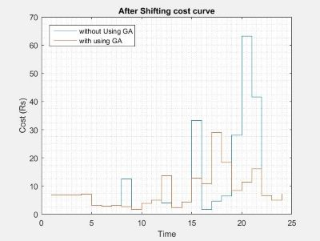

# Cost saving algorithm
###### A cost saving algorithm for potential future use in smart meters.

This is a Matlab project based on the concept of genetic algorithm. 
It yields a reduced cost, for per day electricity consumption (kWh), for the consumer, by implementing load shifting and thereby flattens the load
curve of the grid. Dynamic pricing for consumption is considered.

## Load Shifting Process
The per hour consumption of different appliances of the consumer is given as input in a matrix.
The appliances are separated into two categories: Shiftable and Non-Shiftable.
In case of use of shiftable appliance during peak hours, when per unit cost of consumption is higher, the use of said appliance
is switched to an off-peak hour.

Note: The consumer has the choice to use any appliance during any hour if they wish to. The algorithm can be set according to the need of the consumer.

## Cost Comparison
This is a sample output for an arbitrary consumer for demonstration purposes.

The algorithm results in over 25% savings of per-day cost of consumption for the consumer.

    Per-day cost before algorithm (in Rupees): 268.345
    Per-day cost after algorithm (in Rupees): 196.385
    Percent Saving: 26.8162%
